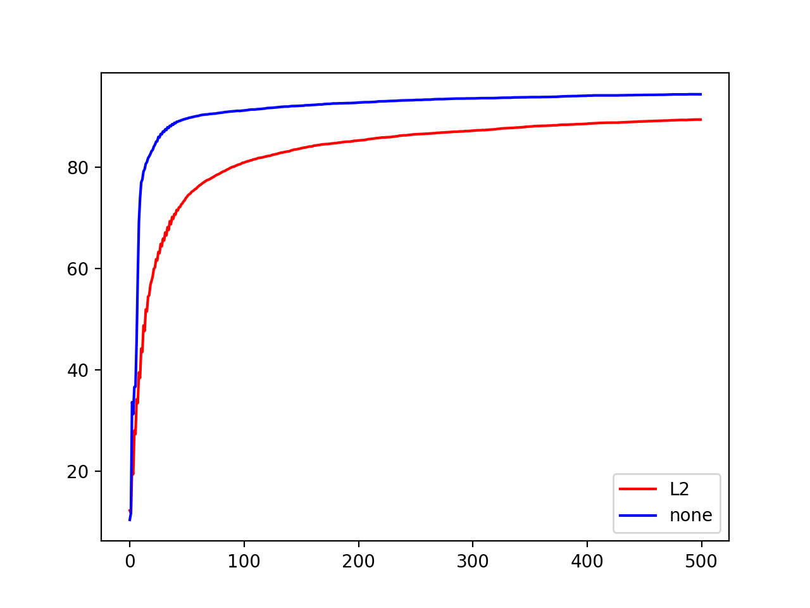

### 手写数字识别实验报告

191300085 周昱辙

### 实验过程

#### 数据的表示

本次实验使用单隐层的多层感知机对手写数字数据集进行训练和学习。训练集和测试集均使用numpy中的矩阵表示。特征矩阵的一行代表一个样本，特征矩阵的一列代表一个特征。标签矩阵为一个向量，表示每个样本的真实标记。使用矩阵表示的目的为并行化处理，否则对单一样本进行for循环操作时间消耗会很大。

#### 激活函数

使用激活函数使得多层感知机具有学习非线性的能力。本次实验输入层到隐层的激活函数使用Sigmoid函数，隐层到输出层的激活函数使用softmax函数。其中，softmax函数将得到的向量进行和归一化处理，将神经网络的输出转化成各个类别的概率；同时引入softmax函数的好处还有方便交叉熵对各个参数求导，使得更新参数的公式更简洁。

```python
def sigmoid(x):
    return 1 / (1 + np.exp(-x))
def soft_max(X):
    reg = np.sum(np.exp(X), axis=1)
    return np.exp(X) / reg.reshape(-1, 1)
```

#### 损失函数

损失函数用于度量误差，合适的损失函数为参数更新的目标做出正确的指引。本次实验对MSE和交叉熵这两种常见的损失函数进行了对比。

##### MSE

```python
def mse_loss(y_true, y_pred):
    return np.square(np.subtract(y_true, y_pred)).mean()
```
MSE即均方误差，在回归问题上使用MSE往往能取得很好的效果。基于MSE，对参数的更新方式如下：

```python
b = sigmoid(np.dot(X, self.v) - self.gamma)
y_pred = soft_max(np.dot(b, self.w) - self.theta)
g = np.multiply(y_pred, np.multiply(1 - y_pred, y - y_pred))
a = np.dot(self.w, g.T)
e = b * (1 - b) * a.T
for i in range(X.shape[0]):
    tmp1 = g[i].reshape(1, g.shape[1])
    tmp2 = e[i].reshape(1, e.shape[1])
    tmp3 = b[i].reshape(1, b.shape[1])
    tmp4 = X[i].reshape(1, X.shape[1])
    self.w += learning_rate * np.dot(tmp3.T, tmp1)
    self.theta -= learning_rate * g[i]
    self.v += learning_rate * np.dot(tmp4.T, tmp2)
    self.gamma -= learning_rate * e[i] + self.gamma
```
其中，前两行代码是神经网络的前向传播，g、a、e是与梯度有关的更新参数。使用for循环对每一个样本进行遍历，在遍历过一个样本后便根据学习率去更新参数，所以这是标准BP算法。使用标准BP算法可以加快模型的训练，而使用累积BP算法在实现中发现运行很慢，且参数更新频率过低，所以本次实验主要使用标准BP算法。

##### 交叉熵

```python
def cross_entropy(y_true, p):
    # y_true: 60000*10 经过one-hot编码  
    # p: 60000*10
    return np.sum(np.multiply(y_true, -np.log(p)), axis=1).mean()
```
在实验过程中，我在想为什么神经网络的输出层为什么不能只设置一个神经元输出相应的类别即可。而真正的做法是将标签向量使用one-hot编码，将其映射为n_class维的向量。这样做的原因与cross_entropy有关。在使用one-hot编码后交叉熵的计算更加方便，而且交叉熵与soft_max的一起使用会是一个很好的判定分布差异的标准。而只输出一个类别显然没有考虑到概率分布的信息，因此不可取。以下为基于交叉熵参数更新的实现：

```python
g = y_pred - y
a = np.dot(self.w, g.T)
e = b * (1 - b) * a.T
for i in range(X.shape[0]):
    tmp1 = g[i].reshape(1, g.shape[1])
    tmp2 = e[i].reshape(1, e.shape[1])
    tmp3 = b[i].reshape(1, b.shape[1])
    tmp4 = X[i].reshape(1, X.shape[1])
    self.w -= learning_rate * np.dot(tmp3.T, tmp1)
    self.theta -= learning_rate * g[i]
    self.v -= learning_rate * np.dot(tmp4.T, tmp2)
    self.gamma -= learning_rate * e[i] + self.gamma
```
容易看出，除了参数g的不同和w与v的更新方向不同外，基于交叉熵的参数更新与基于MSE的参数更新类似。这是因为二者输入层到隐层的激活函数均为sigmoid。

#### 参数初始化

合适的参数初始化可以使避免梯度爆炸或者梯度消失。本次实验考虑了两种不同的参数初始化方式，并对二者进行了对比。

##### 随机初始化

随机初始化即对权值初始进行随机的赋值，之所以使用随机初始化而不是全0初始化，是因为全0初始化会导致隐层单元的权值全部为0。而如果将权值全设置为相同的其它值，则会导致隐层单元的值全都相等。所以随机初始化找到全局最优解得概率会较高一些。

```python
self.v = np.random.randn(d, q)
self.w = np.random.randn(q, l)
self.gamma = np.random.randn(q)
self.theta = np.random.randn(l)
```

##### Xavier初始化

Xavier初始化基于每一层输出的方差应该尽量相等的思想，通过正态分布采样来对权重进行初始化。Xavier初始化基于假设：激活函数在0周围的导数接近于1；偏置项初始化为0，期望为0；参数初始化期望均为0。因此，对Sigmoid激活函数使用Xavier初始化符合要求。

```python
self.v = np.random.normal(loc=0, scale=4*np.sqrt(2/(d+q)), size=(d,q))
self.w = np.random.normal(loc=0, scale=4*np.sqrt(2/(l+q)), size=(q,l))
self.gamma = np.random.randn(q)
self.theta = np.random.randn(l)
```

#### 数据正则化

数据正则化可以降低过拟合的风险。原因是加入正则化项使得模型得到的解更稀疏更简单。而简单的模型往往才是需要拟合的模型。数据正则化有很多种方法，在实验过程中实现了两种。L2正则化是在损失函数后面增加一项需要更新参数的L2范数，而L1正则化则是在损失函数后面增加一项需要更新参数的L1范数。相对于L2范数，L2范数更容易得到稀疏解，可以用于特征选择。由于损失函数的形式发生了改变，因此在更新参数时需要考虑改变后的损失函数的影响。由于仅增添了一项和式，所以更新参数的形式也非常简单。

```python
# L2正则化
if reg == "L2":
    self.w -= learning_rate * (np.dot(tmp3.T, tmp1) + self.w / X.shape[0])
    self.theta -= learning_rate * (g[i] + self.theta / X.shape[0])
    self.v -= learning_rate * (np.dot(tmp4.T, tmp2) + self.v / X.shape[0])
    self.gamma -= learning_rate * (e[i] + self.gamma / X.shape[0])
# L1正则化
elif reg == "L1":
    self.w -= learning_rate * (np.dot(tmp3.T, tmp1) + np.sign(self.w) / X.shape[0])
    self.theta -= learning_rate * (g[i] + np.sign(self.theta) / X.shape[0])
    self.v -= learning_rate * (np.dot(tmp4.T, tmp2) + np.sign(self.v) / X.shape[0])
    self.gamma -= learning_rate * (e[i] + np.sign(self.gamma) / X.shape[0])
```

#### 学习率更新方式

学习率的设置对模型影响较大。当学习率较小时，模型收敛速度可能特别慢，而且容易陷入局部最优。当学习率较大时，模型则可能不能收敛到预期范围，在最优点附近徘徊。所以，动态调整学习率可以使得模型较快收敛至最优解。本次实验对比了固定学习率更新和周期性学习率调整(CLR)。CLR让学习率在一个区间内周期性的增大和减小，通常可以使用线性缩放来调整学习率。

```python
if update == 'CLR':
    if count <= 4:
        learning_rate -= L
        count += 1
    elif count > 4 and count <= 9:
        learning_rate += L
        count += 1
        if count == 10:
            count = 0
```
上述代码块中L设置为学习率的十分之一，使得学习率可以在$\frac{1}{2}$learning_rate至learning_rate间更新。

### 实验对比

#### 不同正则化方式

设置隐层神经元个数为100个，固定其他参数不变，对比L2正则化和不使用正则化的结果。

.
.
.
.
.

  


以上左图表示使用L2正则化和不适用正则化在训练集上的误差，右图表示使用L2正则化和不使用正则化在测试集上的准度。可见，不使用正则化收敛较快，且在本例上没有出现明显的过拟合。推测隐层神经元较少，所以过拟合风险较低。将隐层神经元设置为500，分别使用L1、L2和不使用正则化再进行1000轮实验，得到的最终结果如下：

  


从结果可以看出，虽然使用L1正则化在训练集上的误差最大，但是其泛化误差最低。不使用正则化在训练集上的误差最小，但是其泛化误差最高。所以说正则化确实可以抑制过拟合，且在本实验上，L1正则化比L2正则化效果要好。

#### 不同的参数初始化方式

设置隐层神经元个数为100，固定其他参数不变。比较不同参数初始化方式对模型训练的影响。

  


下图左图表示随机初始化和Xavier初始化在训练集上的误差随epoch的变化趋势；右图表示随机初始化和Xavier初始化在测试集上的正确率随epoch的变化趋势。可以看出，Xavier初始化极大地加快了模型收敛的速率。

.

#### 不同的损失函数

对比mse和交叉熵对模型训练的影响。

  


左图代表在训练集上二者的误差，右图表示测试集上二者的准确率。左图其实并没有实际意义，因为损失函数的值仅仅是一种度量，对比不同的损失函数的误差是没有意义的。可以看出，均方误差没有交叉熵好用。事实上，经历很多次实验，发现使用mse最多能达到正确率75%左右。所以说选择合适和损失函数至关重要。

#### 不同的学习率更新方法

对比固定学习率和CLR对模型训练的影响。

  


我只实现了线性增长/衰减学习率，可以看出，不管是训练集的误差还是测试集的准度，二者相差不大。推测可能的原因是学习率本身设置的太小，模型并没有达到收敛。然而当我增大学习率时，发现训练集上的loss逐渐指数增大至nan。推测遇到了梯度爆炸。对数据进行Min-Max归一化后并没有得到明显的改进，这是我本次实验的不足之处。

### 最终结果

设置单隐层100个神经元，使用固定学习率、Xavier初始化、交叉熵、不使用正则化训练5000个epoch，在测试集上能达到97.59%的准确率。结果如图：

